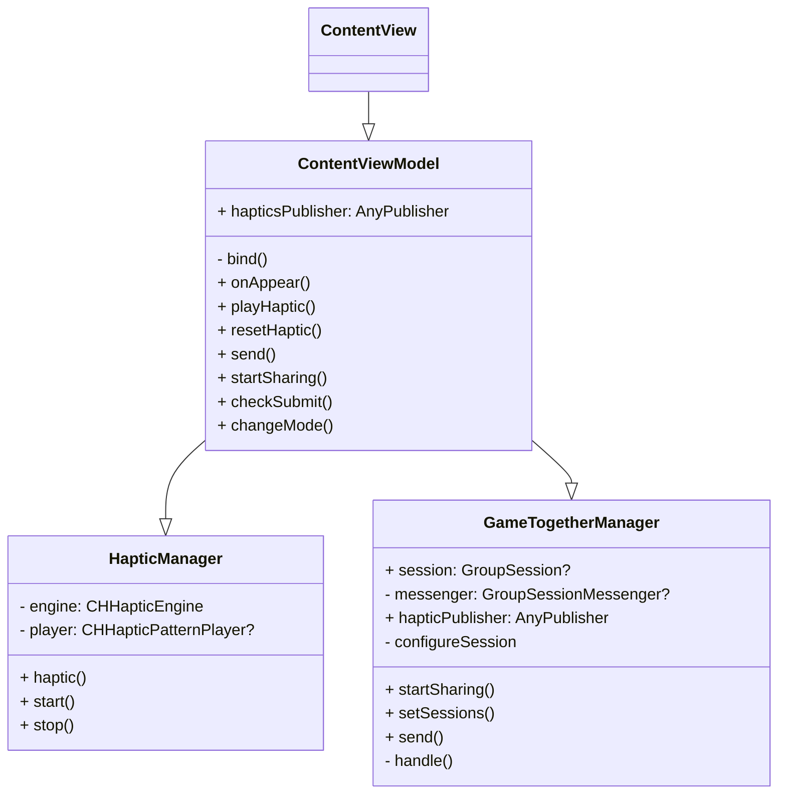

# 2024-NC2-M0-AugmentedReality
## 👫 Pair

| 이름 | 이지(임이지) | 뉴준성(김준성) |
| ---- | ---- | ---- |
| **프로필 사진** | <a href="https://github.com/izzy0426"></a>  | <a href="https://github.com/newJunsung"></a> |
| **역할** | 디자인 | 테크 |
| **GitHub** | [@ez](https://github.com/izzy0426) | [@newJunsung](https://github.com/newJunsung) |
## 🎥 Youtube Link
(추후 만들어진 유튜브 링크 추가)

## 💡 About Core Haptics
(해당 기술에 대한 조사 내용 정리)

**CoreHaptics**에는 소리와 진동을 실행시킬 수 있는 것을 알게 됨. 
`CHHapticEngine을` 이용해서 소리 및 진동을 관리하는 하드웨어를 제어할 수 있다는 것을 알게 됨. 
`CHHapticPattern` 소리 및 진동에 대한 패턴을 만들 수 있다는 것을 알게 됨. 
`CHHapticPatternPlayer`을 이용하여 햅틱에 대한 패턴을 재생할 수 있다는 것을 알게 됨. 


> **예시** <br/><br/>
_(내용 중략) <br/>
ARKit에서 ARSCNView가 있다는 것을 알게 되었고, ARSCNView에서는 SceneKit을 활용하여 3D 콘텐츠를 증강하여 추가할 수 있다는 것을 알게 되었다. <br/>
(내용 중략)_

## 🎯 What we focus on?

**CoreHaptics**에 진동과 소리 중, 진동에 중점을 두기로 함. 
`CHHapticEventParameter`을 이용하여 특정 intensity, sharpness, duration을 가진 진동 이벤트를 만들고, 이를 `CHHapticPatternPlayer로` 만들고 실행시키고자 함. 
사용자가 랜덤한(또는 상대방이 만들어낸) 진동을 맞추며 재미를 느끼게 하고자 함. 

## 💼 Use Case
- 랜덤으로 생성된 햅틱의 intensity, sharpness, duration을 설정하여 맞출 수 있다.
- SharePlay를 이용하여 FaceTime을 하고 있는 친구의 진동을 받아 맞출 수 있다.

## 🖼️ Prototype
(프로토타입과 설명 추가)

## 🛠️ About Code
- 햅틱을 지원하지 않는 기종 등의 이유로 `HapticManager`를 만들 수 없는 상황이 되면, `nil`을 반환하게끔 함.
```swift
//  HapticManager.swift

init?() {
    do {
        let capablitity = CHHapticEngine.capabilitiesForHardware()
        
        if capablitity.supportsHaptics {
            let engine = try CHHapticEngine()
            self.engine = engine
            try engine.start()
            print("haptic manager return.")
        } else {
            print("haptic manager nil.")
            return nil
        }
    } catch {
        print(error)
        return nil
    }
}
```

- 프로토콜을 매개변수로 받아서 다양한 타입을 받을 수 있게 함. (물론, 해당 프로토콜을 채택해야 함.)
```swift
//  HapticManager.swift

func haptic(
    type: CHHapticEvent.EventType,
    intensity: Float,
    sharpness: Float,
    duration: Float
) throws {
    stop()
    
    let eventParams = [
        CHHapticEventParameter(parameterID: .hapticIntensity, value: intensity),
        CHHapticEventParameter(parameterID: .hapticSharpness, value: sharpness)
    ]
    let event = CHHapticEvent(eventType: .hapticContinuous, parameters: eventParams, relativeTime: 0, duration: TimeInterval(duration))
    let pattern = try CHHapticPattern(events: [event], parameters: [])

    player = try engine.makePlayer(with: pattern)
    start()
}


func haptic(for param: HapticEventParameterable) throws {
    try haptic(
        type: .hapticContinuous,
        intensity: param.intensity, sharpness: param.sharpness,
        duration: param.duration
    )
}
```

### 클래스 다이어그램

