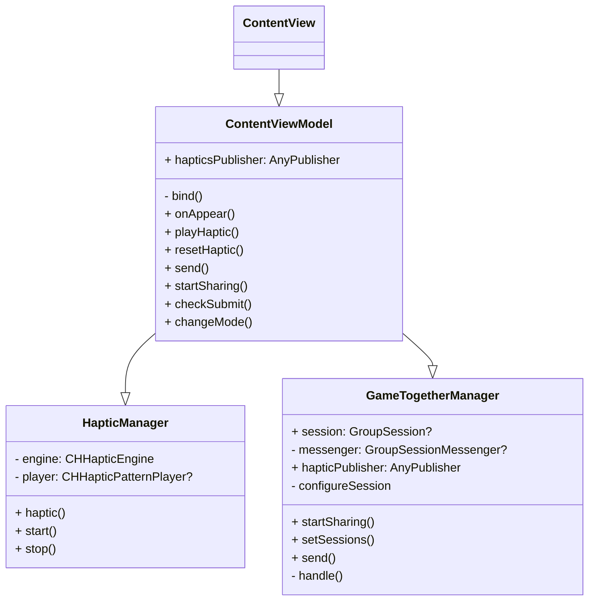

# 2024-NC2-M0-AugmentedReality
## 👫 Pair

| 이름 | 이지(임이지) | 뉴준성(김준성) |
| ---- | ---- | ---- |
| **프로필 사진** | <a href="https://github.com/izzy0426"></a>  | <a href="https://github.com/newJunsung"></a> |
| **역할** | 디자인 | 테크 |
| **GitHub** | [@ez](https://github.com/izzy0426) | [@newJunsung](https://github.com/newJunsung) |
## 🎥 Youtube Link
(추후 만들어진 유튜브 링크 추가)

## 💡 About Core Haptics
(해당 기술에 대한 조사 내용 정리)

- 이벤트를 기반으로 한 오디오 / 햅틱 랜더링 API
- 기본 햅틱이 여러 인터페이스 요소에 자동으로 들어가 있지만, Core Haptics 를 사용하면 기본적인 패턴을 넘어서 촉각(진동)과 소리 피드백과 같은 **햅틱을 커스텀**해서 기능을 확장할 수 있다.
- 햅틱을 일관성 있게 사용해야하며, 과도한 사용은 지양한다.
- 사용자의 몰입도를 높여준다.
- 지원하는 하드웨어 인지 확인이 필요하다.

- **CoreHaptics**에는 소리와 진동을 실행시킬 수 있는 것을 알게 됨. 
- `CHHapticEngine을` 이용해서 소리 및 진동을 관리하는 하드웨어를 제어할 수 있다는 것을 알게 됨. 
- `CHHapticPattern` 소리 및 진동에 대한 패턴을 만들 수 있다는 것을 알게 됨. 
- `CHHapticPatternPlayer`을 이용하여 햅틱에 대한 패턴을 재생할 수 있다는 것을 알게 됨. 

## 🎯 What we focus on?

보조적인 수단이 아닌 햅틱 자체에서 재미를 찾고자 했음. **CoreHaptics**에 진동과 소리 중, 진동에 중점을 두기로 함. 
`CHHapticEventParameter`을 이용하여 특정 intensity, sharpness, duration을 가진 진동 이벤트를 만들고, 이를 `CHHapticPatternPlayer로` 만들고 실행시키고자 함. 
사용자가 랜덤한(또는 상대방이 만들어낸) 진동을 맞추며 재미를 느끼게 하고자 함. 

## 💼 Use Case
- CoreHaptics 기술을 이용하여 심심할 때 진동을 마음대로 조절하며 가지고 놀 수 있게 하는 앱

> 💡 **절대진감**

- 임의로 주어지는 진동을 intensity와 sharpness, duration의 조정을 통해 맞춘다.
- intensity와 sharpness, duration의 조정으로 새로운 진동을 만들고 공유한다.
- 친구가 공유한 진동을 intensity와 sharpness, duration의 조정으로 맞춘다.

## 🖼️ Prototype
(프로토타입과 설명 추가)

1. **1인 모드**
    1. 컴퓨터가 랜덤하게 제공하는 진동 듣기
    2. 사용자가 커스텀한 진동 듣기
    3. Intensity, Sharpeness, Duration 설정하기
    4. 커스텀한 진동을 제출한 후 결과 확인하기
    5. 실패한 경우 재시도하기
2. **2인 모드**
    1. 페이스타임을 통해 SharePlay 연결하기
    2. Intensity, Sharpeness, Duration을 조정하여 나의 진동 커스텀하기
    3. 나의 진동의 이름을 바꾸고 상대에게 공유하기
    4. 상대가 공유한 진동을 받고 듣기
    5. Intensity, Sharpeness, Duration을 조정하여 상대의 진동 맞추기
    6. 커스텀한 진동을 제출한 후 결과 확인하기
    7. 실패한 경우 재시도하기

## 🛠️ About Code
- 햅틱을 지원하지 않는 기종 등의 이유로 `HapticManager`를 만들 수 없는 상황이 되면, `nil`을 반환하게끔 함.
```swift
//  HapticManager.swift

init?() {
    do {
        let capablitity = CHHapticEngine.capabilitiesForHardware()
        
        if capablitity.supportsHaptics {
            let engine = try CHHapticEngine()
            self.engine = engine
            try engine.start()
            print("haptic manager return.")
        } else {
            print("haptic manager nil.")
            return nil
        }
    } catch {
        print(error)
        return nil
    }
}
```

- 프로토콜을 매개변수로 받아서 다양한 타입을 받을 수 있게 함. (물론, 해당 프로토콜을 채택해야 함.)
```swift
//  HapticManager.swift

func haptic(
    type: CHHapticEvent.EventType,
    intensity: Float,
    sharpness: Float,
    duration: Float
) throws {
    stop()
    
    let eventParams = [
        CHHapticEventParameter(parameterID: .hapticIntensity, value: intensity),
        CHHapticEventParameter(parameterID: .hapticSharpness, value: sharpness)
    ]
    let event = CHHapticEvent(eventType: .hapticContinuous, parameters: eventParams, relativeTime: 0, duration: TimeInterval(duration))
    let pattern = try CHHapticPattern(events: [event], parameters: [])

    player = try engine.makePlayer(with: pattern)
    start()
}


func haptic(for param: HapticEventParameterable) throws {
    try haptic(
        type: .hapticContinuous,
        intensity: param.intensity, sharpness: param.sharpness,
        duration: param.duration
    )
}
```

### 클래스 다이어그램

